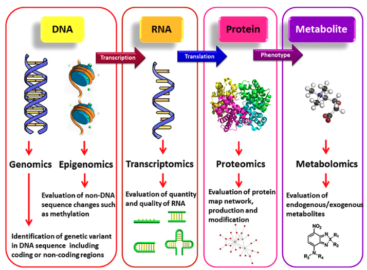
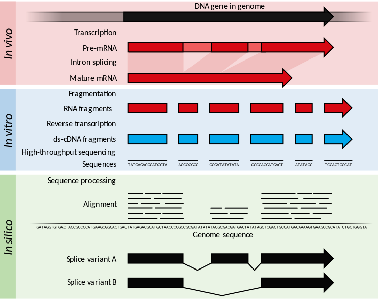
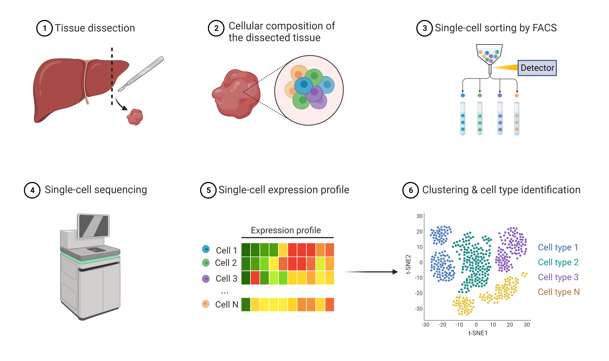
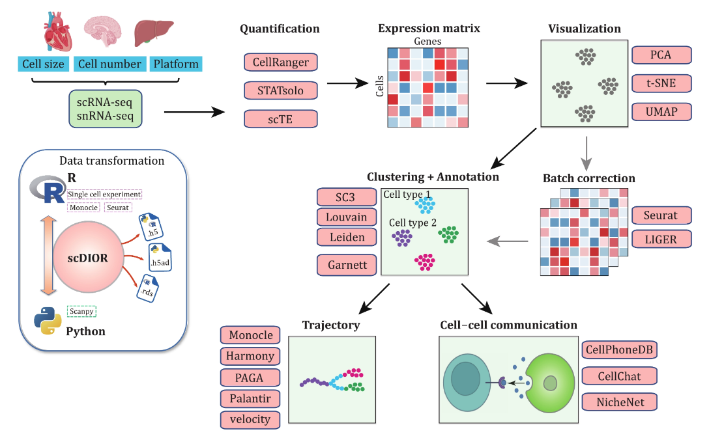
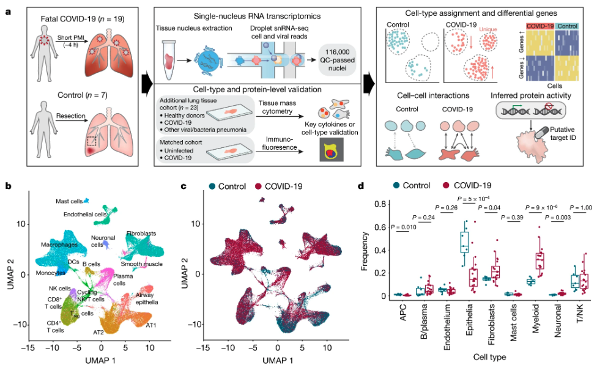

## Background
### Landscape of omics

The various primary tiers of “omics” technologies provide a detailed examination of cellular molecules, including genetic variations in DNA sequences (Genomics), modifications that do not alter the DNA sequence such as histone modification and methylation (Epigenomics), analysis of RNA expression and structural variants like splice sites (Transcriptomics), assessment of protein expression, modifications, and interactions (Proteomics), and characterization of active metabolites within cells (Metabolomics). Integrating these diverse omics technologies can enhance the diagnosis, prognosis, and development of treatments for cancers. [1]




### RNA sequencing (RNA-Seq)

RNA-seq is a powerful genomic approach for **studying messenger RNA (mRNA)** in biological samples. It allows researchers to detect and quantitatively analyze mRNA to study cellular responses to their microenvironment. RNA-Seq maps out all the **RNA molecules**, helping scientists understand **which parts of the genome are active in producing proteins** and other important molecules for life functions. The following image provides a summary of RNA-Seq: [2]

<br>



<br>

##### In vivo (within the organism):
* **Transcription**: Genes in the DNA are transcribed to form pre-mRNA, which includes introns (non-coding regions) and exons (coding regions).
* **Intron Splicing**: In eukaryotic organisms, the introns are removed from the pre-mRNA to produce mature mRNA transcripts, which only contain the coding sequences (exons).
##### In vitro (in a lab setting):
* **Fragmentation**: The mature mRNA is broken down into smaller pieces.
* **Reverse Transcription**: These RNA fragments are converted into double-stranded cDNA (complementary DNA), which is more stable for handling.
* **High-throughput Sequencing**: The cDNA fragments are sequenced using advanced sequencing techniques that generate short reads of the genetic sequences.
##### In silico (using computer software):
* **Sequence Processing**: The short reads obtained from sequencing are aligned to a reference genome sequence. This helps to determine the exact regions of the genome from which the RNA was transcribed.
* **Reconstruction**: By aligning these sequences to the genome, researchers can identify which genes are active, their expression levels, and any variations in the way the RNA might be spliced (alternative splice variants).

<br>

**Limitation**: RNA-Seq analyzes the pooled mRNA from thousands to millions of cells, which **averages the gene expression** and obscures the heterogeneity among individual cells.

<br>
<br>

### Single-cell RNA sequencing (scRNA-seq)

To address this limitation of traditional RNA-seq, scRNA-seq is employed. This technique allows for the analysis of RNA at the single-cell level, enabling researchers to observe the transcriptome and heterogeneity (diversity) of individual cells within a diverse population [3]

<br>




## Typical Workflow in RNA-Seq Analysis

The scRNA-seq data analysis process begins with selecting the appropriate single-cell platform, as each offers distinct advantages and constraints. Once sequencing is complete, expression matrices are generated using quantification tools. Researchers may need to merge these matrices, applying batch correction techniques to address discrepancies. Subsequently, the data undergo dimensionality reduction for visualization, and cells are clustered and annotated for biological insights. Cells can also be arranged in a sequence according to a predicted timeline in pseudotime or analyzed for intercellular communication. Recommended tools for these tasks are provided in the highlighted box. [6]



### Scanpy – Single-Cell Analysis in Python

Scanpy is a widely used open-source Python library designed for analyzing single-cell gene expression data. It was developed to facilitate scalable and comprehensive analysis of large datasets typical in single-cell RNA sequencing (scRNA-seq).  [7]

---

## Problem

The [paper](https://www.nature.com/articles/s41586-021-03569-1) describes a study on how severe COVID-19 affects the lungs. [4]

Researchers conducted **single-nucleus RNA sequencing** on lung tissues from **19 people who died from COVID-19** and **7 healthy individuals**.

The study found significant changes in the types of cells present in the lungs, how these cells function, and how they communicate with each other, providing new insights into why severe COVID-19 can be deadly.



#### Key findings include:

* The lungs of COVID-19 patients showed high levels of inflammation and were filled with specific types of immune cells (monocyte-derived and alveolar macrophages) that were overly active but not functioning properly.
* There was a lack of effective T cell responses, which are crucial for fighting viral infections.
* Two specific proteins, interleukin-1β from immune cells and interleukin-6 from lung cells, were particularly prominent in COVID-19 patients compared to those with other types of lung infections.

#### Dataset Description

Profiling 116,314 cells using snRNA-seq of 20 frozen lungs obtained from 19 COVID-19 decedents and seven control patients with short postmortem interval (PMI) autopsies. The COVID-19 cohort comprises seven female and 12 male decedents, including 13 patients of Hispanic ethnicity, with an age range from 58 to >89 years who had acquired SARS-CoV-2 infection and succumbed to the disease. The average time from symptom onset to death was 27.5 days (range, 4–63 days). After rapid autopsy with a median PMI of 4 hours (range 2–9 hours) collected tissues were either flash-frozen or frozen following OCT (optimal cutting temperature) embedment and subjected to snRNA-seq using a droplet-based platform (10x Genomics). All included patients had underlying hypertensive disorder and frequently one or more additional co-morbidities associated with increased risk for severe COVID-19. [5]

For more detailed information, you can view the full dataset description on the NCBI GEO database [here](https://www.ncbi.nlm.nih.gov/geo/query/acc.cgi?acc=GSE171524). From the given link, download the file named **GSE171524_RAW.tar** and extract the files to the data folder. The given datasets have the following names:

* GSM522XXXX_CXX**ctr**_raw_counts.csv.gz: datasets represent control samples (not infected with COVID-19)

* GSM522XXXX_LXX**cov**_raw_counts.csv.gz: datasets are from COVID-19 affected samples

---

## Set up
#### Step 1: Install Jupyter
To use the notebook, you need to install Jupyter. Jupyter can be installed via pip. Open your terminal or command prompt and run the following command:

```
pip install jupyter
```
#### Step 2: Install Required Libraries
Once Jupyter is installed, you need to install several Python libraries that the notebook depends on. Run the following command in your terminal or command prompt to install these libraries:

```
pip install scanpy scvi-tools seaborn numpy matplotlib diffxpy gseapy scipy igraph leidenalg
```

#### Step 3: Launch Jupyter Notebook
After installing Jupyter and the required libraries, you can start the Jupyter Notebook by running this command in your terminal or command prompt:

```
jupyter notebook
```

---

## References
[1] A. Farshbaf, R. Zare, F. Mohajertehran, and N. Mohtasham, “New diagnostic molecular markers and biomarkers in odontogenic tumors,” Molecular biology reports, Apr. 01, 2021. https://link.springer.com/article/10.1007/s11033-021-06286-0

[2] “RNA-Seq,” Wikipedia, May 09, 2024. https://en.wikipedia.org/wiki/RNA-Seq

[3] “Single Cell RNA Sequencing (scRNA-seq) | AAT Bioquest.” https://www.aatbio.com/catalog/single-cell-rna-sequencing-scrna-seq

[4] J. C. Melms et al., “A molecular single-cell lung atlas of lethal COVID-19,” Nature, Apr. 29, 2021. https://www.nature.com/articles/s41586-021-03569-1

[5] “GEO Accession viewer.” https://www.ncbi.nlm.nih.gov/geo/query/acc.cgi?acc=GSE171524

[6] J. He, L. Lin, and J. Chen, “Practical bioinformatics pipelines for single-cell RNA-seq data analysis,” Biophysics reports, Jan. 01, 2022. http://www.biophysics-reports.org/en/article/doi/10.52601/bpr.2022.210041

[7] “Scanpy – Single-Cell Analysis in Python,” Scanpy. https://scanpy.readthedocs.io/en/stable/